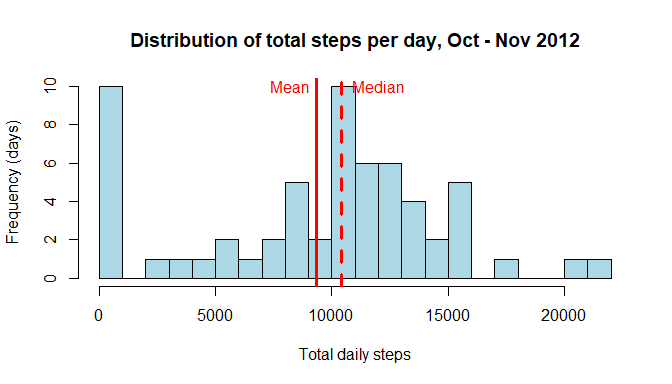
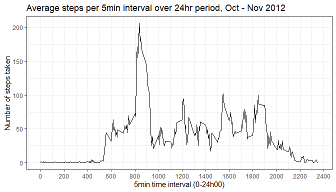
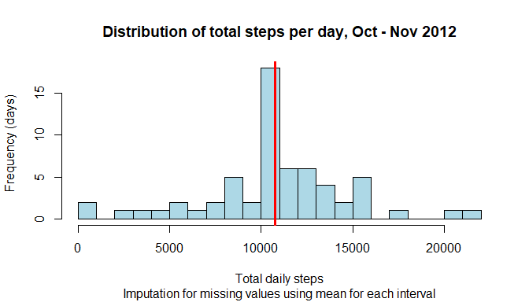
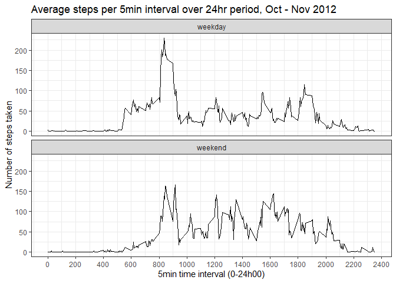

Date: 2020-04-16


## Loading and preprocessing the data
A project file was cloned from repository on [RPeng](http://github.com/rdpeng/RepData_PeerAssessment1) github page 
and is saved in a local project file.

We will start by unzipping the file and identifying relevant file:


```r
if(!file.exists("data")) {
  dir.create("data")
}

unzip("activity.zip", exdir = "./data")
dir("./data")
```

```
## [1] "activity.csv"
```

There is just the one csv file to be read in:


```r
activity <- read.csv("./data/activity.csv")
```

```r
str(activity)
```

```
## 'data.frame':	17568 obs. of  3 variables:
##  $ steps   : int  NA NA NA NA NA NA NA NA NA NA ...
##  $ date    : Factor w/ 61 levels "2012-10-01","2012-10-02",..: 1 1 1 1 1 1 1 1 1 1 ...
##  $ interval: int  0 5 10 15 20 25 30 35 40 45 ...
```

```r
summary(activity$steps)
```

```
##    Min. 1st Qu.  Median    Mean 3rd Qu.    Max.    NA's 
##    0.00    0.00    0.00   37.38   12.00  806.00    2304
```

There are quite a few missing values for steps 
which will need to be dealt with later...

## What is mean total number of steps taken per day?
First, we need to format the date variable and 
calculate the total number of steps by date

```r
library(dplyr)
activity$date <- as.Date(activity$date, format="%Y-%m-%d")
step_day <- activity %>% 
  group_by(date) %>% 
  summarise(stepdays = sum(steps, na.rm = TRUE))
head(step_day)
```

```
## # A tibble: 6 x 2
##   date       stepdays
##   <date>        <int>
## 1 2012-10-01        0
## 2 2012-10-02      126
## 3 2012-10-03    11352
## 4 2012-10-04    12116
## 5 2012-10-05    13294
## 6 2012-10-06    15420
```

```r
mean_step <- round(mean(step_day$stepdays, na.rm = TRUE), 0)
med_step <-  median(step_day$stepdays, na.rm = TRUE)
```

The mean number of steps taken each day in this period was 9354.

The median number of daily steps was 10395

We can see the reason for this difference in a histogram: 
there are many days with a 0 value for total steps 
which is skewing the results


```r
hist(step_day$stepdays, 
     col = "lightblue", 
     breaks = 25,
     main = "Distribution of total steps per day, Oct - Nov 2012",
     xlab = "Total daily steps",
     ylab = "Frequency (days)")
abline(v = mean(step_day$stepdays), col="red", lwd=3)
abline(v = median(step_day$stepdays), col="red", lwd=3, lty=2)
text(8200, 10, "Mean", col = "red")
text(12000, 10, "Median", col = "red")
```

<!-- -->


## What is the average daily activity pattern?
What is the distribution of time intervals?

```r
summary(activity$interval)
```

```
##    Min. 1st Qu.  Median    Mean 3rd Qu.    Max. 
##     0.0   588.8  1177.5  1177.5  1766.2  2355.0
```
Looks like `interval` is a marker of 5 minute intervals using 24hr clock
(00:00 up to 23:55)

We can group by this interval to see total values across all days
by 5 minute interval


```r
step_int <- activity %>% 
  group_by(interval) %>% 
  summarise(stepint = round(mean(steps, na.rm = TRUE), 2))
head(step_int)
```

```
## # A tibble: 6 x 2
##   interval stepint
##      <int>   <dbl>
## 1        0    1.72
## 2        5    0.34
## 3       10    0.13
## 4       15    0.15
## 5       20    0.08
## 6       25    2.09
```
We can examine this daily pattern using a line graph


```r
library(ggplot2)
ggplot(step_int, aes(x=interval, y=stepint)) +
  geom_line() +
  ggtitle("Average steps per 5min interval over 24hr period, Oct - Nov 2012") +
  scale_x_continuous(name = "5min time interval (0-24h00)", breaks = seq(0, 2400, 200)) +
  scale_y_continuous(name = "Number of steps taken") +
  theme_bw()
```

<!-- -->

```r
max_int <- step_int %>% 
  filter(stepint == max(stepint)) %>% 
  select(interval)
```
The 5-minute interval with the greatest average number of steps in this 2 month period
is at 835, (8:35AM)

## Imputing missing values

```r
miss_step <- sum(is.na(activity$steps))
miss_tbl <- round(prop.table(table(is.na(activity$steps)))[2]*100, 1)
```
There are a total of 2304 missing 5min interval values: 
13.1% of all values

To see what influence these missing values have on the distribution, 
we can impute the missing values using mean value for each 5min interval:

```r
activity_imp <- activity %>%
  group_by(interval) %>% 
  mutate(steps = ifelse(is.na(steps), 
                            mean(steps, na.rm = TRUE),
                            steps)) %>% 
  ungroup()
str(activity_imp)
```

```
## Classes 'tbl_df', 'tbl' and 'data.frame':	17568 obs. of  3 variables:
##  $ steps   : num  1.717 0.3396 0.1321 0.1509 0.0755 ...
##  $ date    : Date, format: "2012-10-01" "2012-10-01" ...
##  $ interval: int  0 5 10 15 20 25 30 35 40 45 ...
```
We recalculate the total steps per day with imputed values

```r
step_imp <- activity_imp %>% 
  group_by(date) %>% 
  summarise(stepdays = sum(steps, na.rm = TRUE))
```

If we redo the histogram from above with the imputed values, 
we see mean and median are now the same 

```r
hist(step_imp$stepdays, 
     col = "lightblue", 
     breaks = 25,
     main = "Distribution of total steps per day, Oct - Nov 2012",
     sub = "Imputation for missing values using mean for each interval",
     xlab = "Total daily steps",
     ylab = "Frequency (days)")
abline(v = mean(step_imp$stepdays), col="red", lwd=3)
abline(v = median(step_imp$stepdays), col="red", lwd=3, lty=2)
```

<!-- -->


```r
options(scipen = 999)
mean_step_imp <- round(mean(step_imp$stepdays), 1)
med_step_imp <-  round(median(step_imp$stepdays), 1)
```
Mean total daily steps are 10766.2.

Median total daily steps are 10766.2.

Imputing the missing values eliminated the skew caused by the large number of 0 values

## Are there differences in activity patterns between weekdays and weekends?
We begin by creating the factor variable to distinguish weekdays from weekends:

```r
weekend <- c("Saturday", "Sunday")
activity_imp <- activity_imp %>% 
  mutate(day_type = factor(ifelse(weekdays(date) %in% weekend, 
                           "weekend",
                           "weekday")))
str(activity_imp)
```

```
## Classes 'tbl_df', 'tbl' and 'data.frame':	17568 obs. of  4 variables:
##  $ steps   : num  1.717 0.3396 0.1321 0.1509 0.0755 ...
##  $ date    : Date, format: "2012-10-01" "2012-10-01" ...
##  $ interval: int  0 5 10 15 20 25 30 35 40 45 ...
##  $ day_type: Factor w/ 2 levels "weekday","weekend": 1 1 1 1 1 1 1 1 1 1 ...
```
A plot of average steps by 5-minute interval for weekdays and for weekends

```r
step_imp_int <- activity_imp %>% 
  group_by(day_type, interval) %>% 
  summarise(stepint = round(mean(steps), 2))
head(step_imp_int)
```

```
## # A tibble: 6 x 3
## # Groups:   day_type [1]
##   day_type interval stepint
##   <fct>       <int>   <dbl>
## 1 weekday         0    2.25
## 2 weekday         5    0.45
## 3 weekday        10    0.17
## 4 weekday        15    0.2 
## 5 weekday        20    0.1 
## 6 weekday        25    1.59
```


```r
ggplot(step_imp_int, aes(x=interval, y=stepint)) +
  geom_line() +
  ggtitle("Average steps per 5min interval over 24hr period, Oct - Nov 2012") +
  scale_x_continuous(name = "5min time interval (0-24h00)", breaks = seq(0, 2400, 200)) +
  scale_y_continuous(name = "Number of steps taken") +
  facet_wrap(~day_type, ncol = 1) +
  theme_bw()
```

<!-- -->

There are differences in weekday and weekend step activity for this individual:
on the weekend there are two peaks of activity in the morning suggesting that on
one of the weekend days this individual gets up and active at approximately the same time 
as on weekdays, while on the other day they sleep in a bit later.

Activity is also more evenly distributed throughout the day on weekends vs. weekdays.
